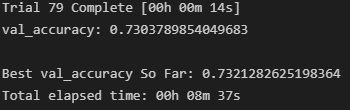

# Neural Network Charity Analysis

## Project Overview
Using the power of neural networks, we will help the non profit foundation, AlphabetSoup predict which companies are worth investing in, and which companies are too high risk. This type of problem and data we will be working with is too complicated for typical statistical and machine learning approaches. Therefore we will be using a deep learning neural network.

## Resources
- Software: 
	- Python 3.7.10
	- Jupyter Notebook
	- Pandas Library
	- tensorflow Library
	- sklearn Library
	- Pandas Library
	- matplotlib Library
- Resources:
	- resources/charity_data.csv

## Data Preprocessing

The first thing we need to do, is load in the data, and clean it up. 

First, we will drop any unnecessary columns in the data that would not provide any meaningful insights into the analysis, such as the name of the companies, and their unique id numbers. Next we will take a look at each column individually and if they have more than 10 unique values (not including continuous numerical values), we will put the less common values together into bins. Then, we will gather all of the categorical data columns, and using the OneHotEncoder method, we will transform all of the individual categories into numbers that the neural network will be able to understand. The cleaned data set will look like this:

Once the data is cleaned and ready for the neural network, we will separate the variables into our target and features variables. Our 'IS_SUCCESSFUL' column will be our target variable, and every other column will be the features. Next, we will scale all of our data using the StandardScaler method, which will improve the reliability and accuracy of our neural network.

## Compiling, Training, and Evaluating the Neural Network

Once our data is properly processed, we can start defining our neural network model. To begin, we instantiate a sequential neural network model using keras. I chose to have two hidden layers, with 80 and 30 neurons respectively, and an activation function 'relu'. The output layer I chose to use a 'sigmoid' activation function, as our output is binary. 

Next, we compile the model, using the binary crossentropy loss function, the adam optimizer, and the metric we will be using is the accuracy metric. Also as a way for others to test this model and to check its progress through each iteration, we implemented save checkpoints to save the weights of the model every 5 epochs. After the model finishes running, we also save the entire model as well.

Unfortunately, our model was only able to reach an accuracy of 72.8%, with a loss of 55.9%. In an attempt to optimize our model to more accurately predict our data, I implemented the use of kerastuner, which allowed me to create a method that would automate the number of hidden layers and neurons given some initial conditions, as well as choose between a few different activation functions (relu, sigmoid, or tanh).

 

Even with the automated kerastuner, the best accuracy we were able to achieve was only 73.2%, which is only slightly better than our original model. The best model kerastuner was able to find, used 6 hidden layers, and the relu activation function.

## Summary

Using our deep learning neural network, we were able to achieve an accuracy of 73.2%. This does not reach our goal of 75% however, so further improvements to the model could be made in the future. Potentially adding more data could increase our accuracy, or removing data that have less importance to the output. We could also try using other supervised machine learning models such as a Random Forest Classifier algorithm, which would use many basic decision trees in combination.